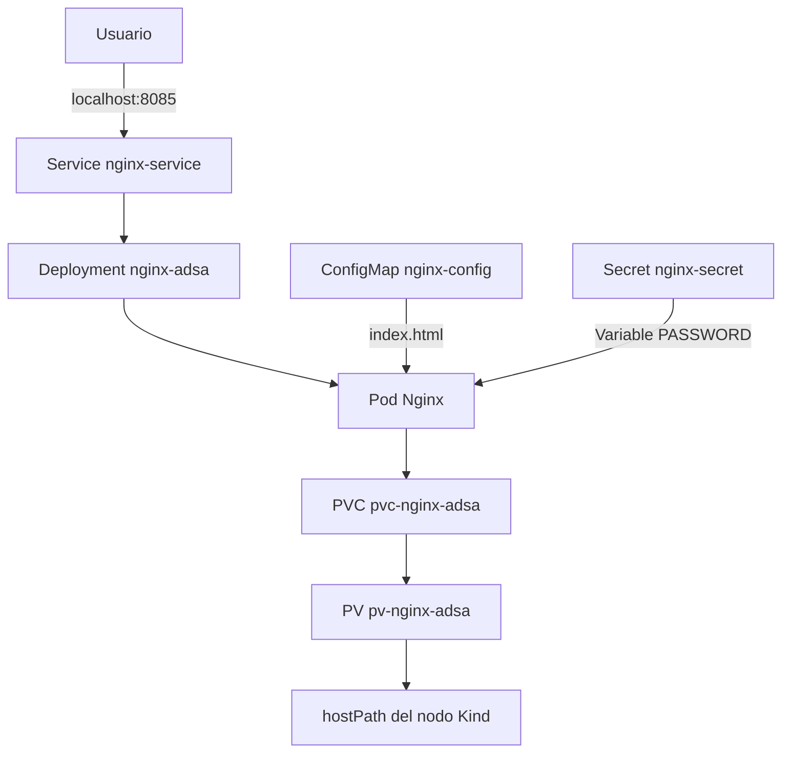

# Proyecto Integrador — Administración de Sistemas Avanzada

## Automatización de una aplicación web persistente en Kubernetes

**Alumno:** Lucas Aponte
**Carrera:** Tecnicatura Superior en Administración de Sistemas y Software Libre
**Asignatura:** Administración de Sistemas Avanzada
**Universidad Nacional del Comahue**

---

# 1. Problema abordado

Las aplicaciones ejecutadas en contenedores tienen un ciclo de vida temporal. Cuando un contenedor o un Pod es eliminado, los datos almacenados únicamente dentro de ese entorno pueden perderse.

Además, desplegar manualmente cada recurso de Kubernetes implica repetir comandos y aumenta la posibilidad de cometer errores.

Este proyecto busca resolver ambos problemas mediante:

* configuración declarativa;
* almacenamiento persistente;
* automatización del despliegue;
* validación del estado final;
* autorrecuperación de la aplicación.

---

# 2. Objetivo del proyecto

Desarrollar un laboratorio reproducible para desplegar una aplicación web Nginx sobre un clúster local Kubernetes creado con Kind.

La solución integra:

* manifiestos YAML;
* Persistent Volume y Persistent Volume Claim;
* ConfigMap;
* Secret;
* Deployment;
* Service;
* scripts Bash de despliegue, validación, prueba y limpieza.

---

# 3. Arquitectura



## Función de cada componente

* **Service:** proporciona el acceso a la aplicación.
* **Deployment:** mantiene una réplica activa de Nginx.
* **ConfigMap:** suministra la página `index.html`.
* **Secret:** inyecta una variable ficticia dentro del contenedor.
* **PVC:** solicita almacenamiento para la aplicación.
* **PV:** proporciona el almacenamiento persistente.
* **Kind:** permite ejecutar el clúster Kubernetes localmente.

> **Punto para explicar:** la configuración y los datos se administran fuera de la imagen del contenedor.

---

# 4. Organización del repositorio

```text
TP-Integrador-AdSA/
├── README.md
├── LICENSE
├── kind/
│   └── cluster.yaml
├── manifests/
│   ├── 00-namespace.yaml
│   ├── 01-pv.yaml
│   ├── 02-pvc.yaml
│   ├── 03-configmap.yaml
│   ├── 04-secret.yaml
│   ├── 05-deployment.yaml
│   └── 06-service.yaml
├── scripts/
│   ├── deploy.sh
│   ├── validate.sh
│   ├── test-persistence.sh
│   └── cleanup.sh
├── web/
│   └── index.html
└── docs/
    └── PRESENTACION.md
```

---

# 5. Configuración declarativa

Los recursos se definen mediante archivos YAML.

## Recursos implementados

| Recurso               | Función                         |
| --------------------- | ------------------------------- |
| Namespace             | Aísla los recursos del proyecto |
| PersistentVolume      | Proporciona almacenamiento      |
| PersistentVolumeClaim | Solicita el volumen             |
| ConfigMap             | Contiene el `index.html`        |
| Secret                | Almacena una variable ficticia  |
| Deployment            | Administra el Pod Nginx         |
| Service               | Permite acceder a la aplicación |

Kubernetes compara el estado real del clúster con el estado deseado definido en los manifiestos.

---

# 6. Automatización

El proyecto incorpora cuatro scripts Bash.

## `deploy.sh`

Aplica todos los manifiestos en el orden necesario y espera que el Deployment quede disponible.

```bash
./scripts/deploy.sh
```

## `validate.sh`

Comprueba:

* nodo en estado `Ready`;
* Pod en estado `Running`;
* PVC en estado `Bound`;
* ConfigMap disponible;
* Secret inyectado;
* contenido de la página web.

```bash
./scripts/validate.sh
```

## `test-persistence.sh`

Crea un archivo en el volumen, elimina el Pod y verifica que el archivo siga disponible después de su recreación.

```bash
./scripts/test-persistence.sh
```

## `cleanup.sh`

Elimina los recursos creados por el proyecto.

```bash
./scripts/cleanup.sh
```

---

# 7. Demostración en vivo

## Paso 1 — Verificar el clúster

```bash
kind get clusters
kubectl get nodes
```

### Resultado esperado

* clúster `adsa-integrador`;
* nodo en estado `Ready`.

---

## Paso 2 — Desplegar la aplicación

```bash
./scripts/deploy.sh
```

### Resultados importantes

```text
deployment "nginx-adsa" successfully rolled out
```

```text
Pod: Running
PVC: Bound
```

---

## Paso 3 — Validar los recursos

```bash
./scripts/validate.sh
```

### Verificaciones principales

* Deployment disponible `1/1`;
* PVC enlazado al PV;
* página del ConfigMap montada;
* variable del Secret presente.


---

## Paso 4 — Acceder a la aplicación

```bash
kubectl port-forward \
  --namespace proyecto-adsa \
  service/nginx-service \
  8085:80
```

Abrir:

```text
http://localhost:8085
```

La página visible fue proporcionada mediante un ConfigMap, sin modificar ni reconstruir la imagen Nginx.

---

# 8. Persistencia y autorrecuperación

En una terminal:

```bash
kubectl get pods \
  --namespace proyecto-adsa \
  --watch
```

En otra terminal:

```bash
./scripts/test-persistence.sh
```

## Secuencia observada

```text
Pod activo
   ↓
Eliminación del Pod
   ↓
Terminating
   ↓
Pending
   ↓
ContainerCreating
   ↓
Running
```

El Deployment recrea automáticamente el Pod porque su estado deseado establece que debe existir una réplica disponible.

El archivo creado previamente continúa disponible porque se almacena en el volumen persistente.

### Resultado esperado

```text
PRUEBA EXITOSA: el archivo persistió después de recrear el Pod.
```

---

# 9. Resultados obtenidos

Durante las pruebas se verificó que:

* el clúster local funciona correctamente;
* el despliegue puede realizarse mediante un único script;
* el Pod queda en estado `Running`;
* el PVC queda en estado `Bound`;
* la página del ConfigMap se visualiza en el navegador;
* el Secret se inyecta como variable de entorno;
* Kubernetes recrea automáticamente el Pod eliminado;
* los datos persisten después de la recreación;
* el laboratorio puede limpiarse y volver a desplegarse.

---


# 10. Conclusión

El proyecto permitió integrar conceptos de:

* Kubernetes;
* contenedores;
* almacenamiento persistente;
* configuración declarativa;
* automatización;
* validación;
* autorrecuperación.

Los manifiestos YAML permiten definir la infraestructura de manera reproducible, mientras que los scripts Bash simplifican su despliegue y validación.

La prueba final demostró que Kubernetes puede recrear automáticamente un Pod eliminado y que los datos almacenados en el volumen permanecen disponibles después de esa recreación.

El resultado es un laboratorio simple, reutilizable y verificable para comprender principios fundamentales de administración avanzada de sistemas en entornos cloud-native.

---

# 11. Cierre de la demostración

Para eliminar los recursos:

```bash
./scripts/cleanup.sh
```

Para eliminar el clúster:

```bash
kind delete cluster --name adsa-integrador
```


