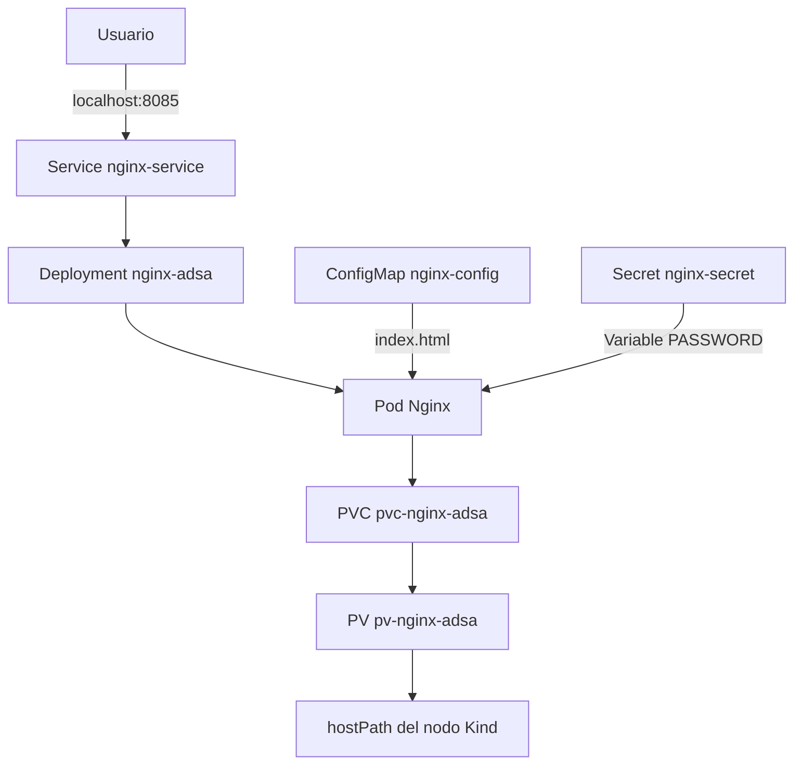

# Proyecto Integrador — Administración de Sistemas Avanzada

## Automatización de una aplicación web persistente en Kubernetes

**Alumno:** Lucas Aponte

**Carrera:** Tecnicatura Superior en Administración de Sistemas y Software Libre

**Asignatura:** Administración de Sistemas Avanzada

**Universidad Nacional del Comahue**

---

# 1. Introducción y objetivo del laboratorio

Este proyecto consiste en un laboratorio reproducible para desplegar una aplicación web Nginx sobre un clúster local de Kubernetes creado con Kind.

La finalidad del laboratorio es integrar distintos conceptos trabajados durante la materia:

* contenedores;
* Kubernetes;
* configuración declarativa;
* almacenamiento persistente;
* ConfigMaps;
* Secrets;
* automatización con scripts Bash;
* validación del despliegue;
* autorrecuperación de Pods.

La aplicación desplegada es simple, pero permite demostrar conceptos importantes de administración avanzada de sistemas: cómo definir infraestructura mediante manifiestos, cómo separar configuración y datos, y cómo automatizar el ciclo de despliegue y prueba.

## Objetivo

Desarrollar un entorno reproducible que permita desplegar, validar y probar una aplicación web persistente en Kubernetes utilizando manifiestos YAML y scripts Bash.

---

# 2. Arquitectura técnica del laboratorio



## Descripción general

El laboratorio utiliza un clúster Kubernetes local ejecutado con Kind.

Dentro del clúster se despliega una aplicación Nginx administrada por un Deployment. La aplicación expone una página web personalizada mediante un ConfigMap, recibe una variable ficticia desde un Secret y utiliza almacenamiento persistente mediante PV y PVC.

El acceso a la aplicación se realiza desde el navegador local mediante `kubectl port-forward`.


---

# 3. Componentes Kubernetes utilizados

| Recurso               | Función en el laboratorio                |
| --------------------- | ---------------------------------------- |
| Namespace             | Aísla los recursos del proyecto          |
| PersistentVolume      | Proporciona almacenamiento persistente   |
| PersistentVolumeClaim | Solicita el volumen para la aplicación   |
| ConfigMap             | Suministra el contenido de la página web |
| Secret                | Inyecta una variable sensible ficticia   |
| Deployment            | Administra el Pod de Nginx               |
| Service               | Expone la aplicación dentro del clúster  |

## Estado deseado

Kubernetes trabaja a partir del estado deseado definido en los manifiestos YAML.

El Deployment indica que debe existir una réplica activa de Nginx. Si el Pod es eliminado, Kubernetes detecta la diferencia entre el estado real y el estado deseado, y crea automáticamente un nuevo Pod.

## Separación de responsabilidades

El proyecto separa:

* la aplicación;
* la configuración;
* los datos persistentes;
* la exposición del servicio;
* la automatización del procedimiento.


---

# 4. Automatización del proyecto

El laboratorio incorpora scripts Bash para evitar ejecutar manualmente cada paso.

## Scripts principales

| Script                | Función                                                      |
| --------------------- | ------------------------------------------------------------ |
| `deploy.sh`           | Aplica los manifiestos y despliega la aplicación             |
| `validate.sh`         | Verifica el estado de los recursos                           |
| `test-persistence.sh` | Prueba persistencia y recreación del Pod                     |
| `cleanup.sh`          | Elimina los recursos del proyecto                            |
| `run-all.sh`          | Ejecuta el flujo completo de despliegue, validación y prueba |

## Ejecución completa

```bash
./scripts/run-all.sh
```

Este script permite crear o reutilizar el clúster, desplegar los recursos, validar el estado final y ejecutar la prueba de persistencia.

También puede reconstruir el laboratorio desde cero:

```bash
./scripts/run-all.sh --fresh
```

---

# 5. Demostración

## Paso 1 — Verificar el clúster

```bash
kind get clusters
kubectl get nodes
```

Resultado esperado:

```text
adsa-integrador
adsa-integrador-control-plane   Ready
```

---

## Paso 2 — Desplegar la aplicación

```bash
./scripts/deploy.sh
```

Resultados importantes:

```text
deployment "nginx-adsa" successfully rolled out
```

```text
pod/nginx-adsa   1/1   Running
persistentvolumeclaim/pvc-nginx-adsa   Bound
```

---

## Paso 3 — Validar los recursos

```bash
./scripts/validate.sh
```

La validación comprueba:

* estado del nodo;
* Deployment disponible;
* Pod en ejecución;
* Service creado;
* PVC enlazado al PV;
* ConfigMap disponible;
* Secret disponible;
* contenido del `index.html`;
* variable `PASSWORD` inyectada en el contenedor.

---

## Paso 4 — Acceder a la aplicación

```bash
kubectl port-forward \
  --namespace proyecto-adsa \
  service/nginx-service \
  8085:80
```

Luego se accede desde el navegador:

```text
http://localhost:8085
```

La página visible fue proporcionada mediante un ConfigMap, sin necesidad de reconstruir la imagen de Nginx.

---

# 6. Persistencia y autorrecuperación

La prueba de persistencia se realiza mediante el script:

```bash
./scripts/test-persistence.sh
```

## Secuencia de la prueba

```text
1. Se crea un archivo dentro del volumen persistente.
2. Se verifica su contenido.
3. Se elimina el Pod activo.
4. Kubernetes crea automáticamente un nuevo Pod.
5. Se comprueba que el archivo sigue existiendo.
```

Para observar la recreación en tiempo real:

```bash
kubectl get pods \
  --namespace proyecto-adsa \
  --watch
```

## Resultado esperado

```text
PRUEBA EXITOSA: el archivo persistió después de recrear el Pod.
```

## Explicación técnica

El archivo no se pierde porque no queda guardado únicamente dentro del contenedor. Se almacena en el volumen persistente asociado al PVC.

El Pod puede eliminarse y recrearse, pero el volumen continúa disponible.


---

# 7. Resultados y conclusión

Durante las pruebas se verificó que:

* el clúster local funciona correctamente;
* el despliegue puede realizarse mediante scripts;
* el Pod queda en estado `Running`;
* el PVC queda enlazado al PV en estado `Bound`;
* la aplicación web se visualiza desde el navegador;
* la página se carga mediante ConfigMap;
* el Secret se inyecta como variable de entorno;
* Kubernetes recrea automáticamente el Pod eliminado;
* los datos persisten después de la recreación del Pod.

## Conclusión

El proyecto permitió integrar contenidos centrales de la materia en un laboratorio simple, verificable y reutilizable.

Los manifiestos YAML permiten definir la infraestructura de manera declarativa, mientras que los scripts Bash automatizan el despliegue, la validación y las pruebas.

La prueba de persistencia demostró que los datos pueden sobrevivir al ciclo de vida del Pod. A su vez, la recreación automática del Pod permitió comprobar el mecanismo de autorrecuperación de Kubernetes.

En síntesis, el laboratorio muestra cómo administrar una aplicación contenedorizada de forma reproducible, separando aplicación, configuración, datos y automatización.

---

# 8. Cierre de la demostración

Para eliminar los recursos del proyecto:

```bash
./scripts/cleanup.sh
```

Para eliminar completamente el clúster Kind:

```bash
kind delete cluster --name adsa-integrador
```


